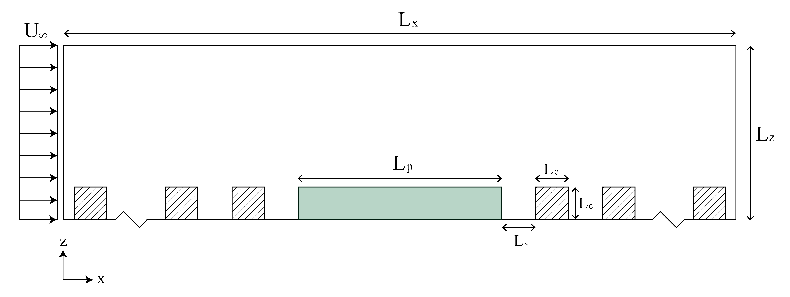
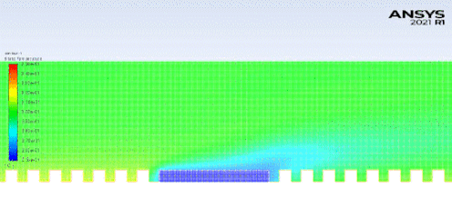

<!-- Main -->

<!-- One -->
<section id="one">
	

		<header class="major">
			<h2>Overview</h2>
		</header>
		
In this file, we describe the workflow of how the Urban Greenery Project simulations were initialized, the results of the simulations, and how these simulations may be modified for different sizes of forests. 

	

</section>

<!-- Two -->
<section id="two" class="spotlights">
	<section>
		
		

			

				<header class="major">
					<h3>Geometry</h3>
				</header>
				
The forest for the Urban Greenery Projects will be modeled as a radially symmetric geometry with the forest at the center and evenly spaced buildings on the exterior. Wind with a uniform velocity profile will blow from one direction. A render of the goemetry is shown on the left. 

			

		

	</section>
	<section>
		
		

			

				<header class="major">
					<h3>Diagram</h3>
				</header>
				
The radially symmetric nature of the geometry allows us to define a characteristic plane. In other words, we can simulate a 2D geometry that accurately represents the 3D geometry. The buildings are be modeled as squares and the forest has a corresponding drag force due to the leaves. 

			

		

	</section>
	<section>
		
		

			

				<header class="major">
					<h3>Results</h3>
				</header>
				
Nullam et orci eu lorem consequat tincidunt vivamus et sagittis magna sed nunc rhoncus condimentum sem. In efficitur ligula tate urna. Maecenas massa sed magna lacinia magna pellentesque lorem ipsum dolor. Nullam et orci eu lorem consequat tincidunt. Vivamus et sagittis tempus.

			

		

	</section>
</section>

<!-- Three -->
<section id="three">
	

		<header class="major">
			<h2>Massa libero</h2>
		</header>
		
The results of this simulation confirms the forests ability to cool surrounding buildings and streets. From here, we are able to start our plans for creating a forest in real life! Check out the progress on our blog.

		<ul class="actions">
			<li><a href="C-blog.html" class="button next">Check it out</a></li>
		</ul>
	

</section>

